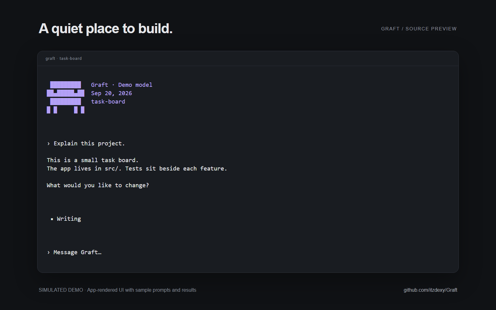

# Graft


An AI coding agent for your terminal. Chat about a project, edit code, run commands, and test websites with a local browser.

The chat shows Buddy, your model, the date, and your project folder. Web activity uses animated site badges and observed source domains. Reduced-motion settings disable the animation.



The screenshot uses app-rendered components and simulated demo content, not a live provider session.

## Install

Requires **Node.js 22+**, **Bun**, **Git**, and **ripgrep (`rg`)** on Windows, macOS, or Linux (x64 / ARM64). Get them from [nodejs.org](https://nodejs.org/), [bun.sh](https://bun.sh/), [git-scm.com](https://git-scm.com/), and [ripgrep](https://github.com/BurntSushi/ripgrep#installation). File search uses `rg` from PATH.

### Windows — PowerShell

```powershell
git clone https://github.com/itzdexy/Graft.git
cd Graft
.\install.ps1 -SourcePath .
```

If your execution policy blocks the downloaded script, review it first, then run:

```powershell
powershell -NoProfile -ExecutionPolicy Bypass -File .\install.ps1 -SourcePath .
```

You can also run `install.cmd` from the downloaded source folder. Reopen your terminal after installation.

### macOS / Linux

```bash
git clone https://github.com/itzdexy/Graft.git
cd Graft
bash install.sh --source .
export PATH="$HOME/.local/bin:$PATH"
```

Add the PATH line to `~/.zshrc` or `~/.bashrc` if needed. Installers build the JavaScript runtime and create a user-local launcher. Administrator access is not required. They do not install a model or create a standalone executable.

### Start

```bash
cd path/to/your-project
graft
```

Use `/provider` to connect a provider, then `/model` to choose a model. Claude/Anthropic, OpenAI-compatible services, and local providers such as Ollama are supported. Available models depend on your provider. For Ollama, start `ollama serve` and install a model separately.

| Command | Purpose |
| --- | --- |
| `/provider` | Connect or switch providers |
| `/model` | Choose a model |
| `/code` | Work on files |
| `/plan` | Plan without changing files |
| `/browser test http://localhost:5173` | Inspect and test a website |
| `/browser status` | Inspect optional Playwright MCP setup |
| `/help` | Available commands |

## Website testing

Install Chrome, Edge, Brave, or Chromium. No cloud-browser subscription or extension is required. Set `GRAFT_BROWSER_PATH` for an unusual browser location.

Ask Graft to test your site, or use `/browser test <url>`. The `WebsiteTest` model tool can:

- Inspect the page's accessibility snapshot.
- Click controls, fill fields, and press keys.
- Assert that text or elements become visible.
- Check desktop (1280×900) and mobile (390×844) viewports.
- Save screenshots and JSON reports, including failed assertions and error counts.

Each call starts a fresh headless browser context. Your personal browser profile and cookies are not used. Artifacts stay in the project's ignored `.graft/browser/` folder. The active model receives the page snapshot and test result, so choose a suitable provider for private sites. Tests can submit forms; an approval prompt appears before the tool runs.

Tests stay on the requested origin. Explicit localhost targets are supported; other private-network targets, downloads, and cross-origin navigation are blocked. This is a testing boundary, not an OS-level browser sandbox. Multi-origin sign-in flows need a separately configured browser integration.

Search badges use terminal-friendly letters and colors, not downloaded favicon images. Counts reflect observed sources.

## Settings and privacy

Settings live under `~/.graft/`. On first launch, Graft imports legacy provider/settings files without overwriting Graft files or deleting the old files. Conversation archives are not copied. `GRAFT_*` settings take precedence over legacy environment aliases.

Keep credentials, `.env`, browser captures, conversation history, and personal agent instructions out of Git. The public repository starts with a reviewed source snapshot rather than prior development history.

## Development

```bash
bun install --frozen-lockfile --ignore-scripts
bun test src scripts
bun run build:runtime
bun scripts/graft-browser-smoke.ts
node bin/graft.js --version
```

The browser smoke test uses a local fixture and requires an installed Chromium-family browser. See [CONTRIBUTING.md](CONTRIBUTING.md) and [installation details](docs/INSTALL.md).

This is a source preview. Browser testing and the Windows launcher have been exercised locally; macOS/Linux installers are provided but have not been executed on those operating systems in this session. The imported application's broad TypeScript check has existing failures. No native EXE, MSI, DMG, or system package is claimed.

See the [release verification record](docs/RELEASE.md) for results and known limitations.

## License

[MIT](LICENSE). Third-party libraries and integrations retain their licenses and notices; see [NOTICE](NOTICE). Claude and other provider/model names identify their respective services.
